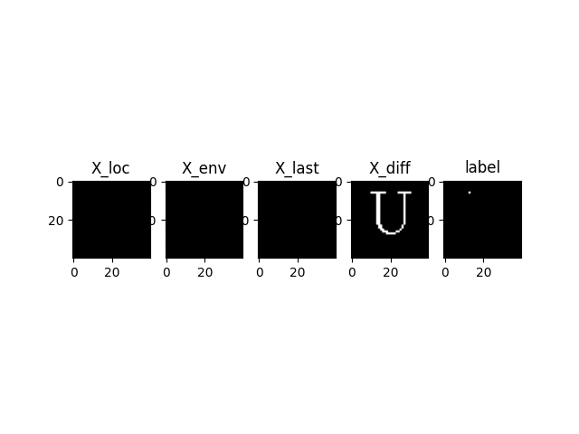

# hershey dataset

Tool to extract svg's from hershey's font definition, dataset of already extracted fonts in svg format is available in compressed to font_svgs zip file.

turns out binary data streams are easily compressible, compressed pickled dataset can be found in ./datasets/

Local Dataset


Global Dataset



### NOTE !

abandoning this dataset because of few reasons and moving to kanjivg characters for dataset:

1. Due to relatively small set of characters in hershey (even with use of data augmentation x4 samples, model is prone to overfitting)

2. redundant strokes or overwritting, even though hershey is single stroke font, strokes are overwritten for better visual appearance which is not a good feature for training

while it is easy to create dataset using svg with only M,L commands, it is not good tradeoff with kanjivg characters which have bezeir curves.

### steps to extract dataset yourself :

few scripts need certain directories with data in place, figure it out with code or wait for the commit with code to handle all directory creation

```
$./extract_hershey_font.py
$./remove_invalid_svg.py  #removes invalid files ex:  empty svg files
$mkdir global_dataset
$./create_globaldataset.py
$mkdir local_dataset
$./create_localdataset.py
```

### Dependencies

```
matplotlib
opencv
numpy
```

## Files

**./extract_hershey_font.py**   python script to read hershey.jhf and output font in .svg format

**./hershey.jhf**               original file by Dr. Hershey contains all characters

**./visualise_dataset.py** 	    visualise pickled dataset

**./create_globaldataset.py**   creates global dataset in ./global_dataset directory

**./create_localdataset.py**    create local dataset in ./local_dataset directory

**./create_metadata.py**        create a metadata file in respective dataset directory with train, test, validation sample values, helpful when experimenting with number of files to include for training and validation ex : for validation_steps, steps_per_epochs

**./tools/chartrace.py** simple tkinter application to trace characters or draw them into svg files.(it needs folder with characters you want to trace as .png files to work)

This dataset was inspired from paper :

### Teaching Robots To Draw

Atsunobu Kotani and Stefanie Tellex

Department of Computer Science

Brown University

### ANOTHER NOTE !

Original paper was based on japanese characters, you can also extract the same using the script in this repository, get the japaneses and roman jhf file from http://paulbourke.net/dataformats/hershey/ (UPDATE : both files are now available in this repository )

### TODO :

- [x] create global dataset

- [x] create local dataset

- [x] create a pickled form of global dataset

- [x] create guide and script to get global and local dataset

- [x] added japanese characters

- [x] upload visualisazations  

- [x] create seperate file to get metadata

- [x] upload actual dataset
